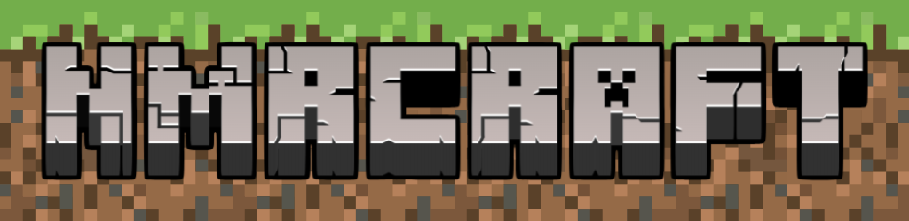

[](https://img.shields.io/github/v/release/mlederbauer/nmrcraft)
[](https://github.com/mlederbauer/nmrcraft/actions/workflows/main.yml?query=branch%3Amain)
[](https://codecov.io/gh/mlederbauer/nmrcraft)
[](https://img.shields.io/github/commit-activity/m/mlederbauer/nmrcraft)
[](https://img.shields.io/github/license/mlederbauer/nmrcraft)

<h1 align="center">
  NMRcraft
</h1>

NMR Chemical Reactivity Analysis with Feature Tracking

INSERT CATCHPHRASE #TODO
How to ... ?
NMRcraft leverages ...

- **Github repository**: <https://github.com/mlederbauer/nmrcraft/>
- **Documentation** <https://mlederbauer.github.io/nmrcraft/>

## 🔥 Usage

WIP #TODO

## 👩‍💻 App

WIP #TODO

## 🖼️Poster

WIP #TODO

## 🧑‍💻 Developing

### Installation

To develop this project, install the environment and the pre-commit hooks with

```bash
conda env create -f environment.yml # alternatively: conda create -n nmrcraft python=3.11 pip
conda activate nmrcraft
make install
```

(You might need to run `pip install poetry` after creating a venv first.)

Repository initiated with [fpgmaas/cookiecutter-poetry](https://github.com/fpgmaas/cookiecutter-poetry).

### Adding dependencies to the project

If you added a new feature that requires a new package/dependency, you can add it to the `pyproject.toml` file and run `make install` to install the new dependencies.

```bash
poetry add <package-name>
```

(You might need to run `poetry lock` to update the `poetry.lock` file if you added a dependency manually in the `pyproject.toml` file.)

### Loading the Data

The dataset is stored in a private repository on HuggingFace. It can easily be loaded as

Begin by installing the library, if not already installed:

```bash
pip install huggingface_hub
```

To download the dataset on the Hub in Python, you need to log in to your Hugging Face account:

```bash
huggingface-cli login
```

Access the dataset:

```python
from datasets import load_dataset
dataset = load_dataset("NMRcraft/nmrcraft", data_files='all_no_nan.csv')
dataset['train'].to_pandas() # contains the data for now
```

Or download locally in just a few lines:

```python
from huggingface_hub import hf_hub_download
hf_hub_download(repo_id="NMRcraft/nmrcraft", filename="all_no_nan.csv", repo_type="dataset", local_dir="./data/")

```

The dataset is provided in its "raw" form as a dataframe in `all_no_nan.csv`, meaning without a train/test split or feature selection.
in the folder `./xyz.zip`, all optimized geometries are added as an .xtpopt.xyz file.

### Running on Docker

To use the docker just git clone this repo and run the following commands on _Linux/MacOS_ to build and run an image:

```bash
docker buildx build -t pypy .
```

```bash
docker run -v ./.:/NMRcraft -it pypy
```

On Windows powershell, the commands are:

```bash
docker.exe buildx build -t pypy .
```

```bash
docker.exe run -v ./.:/NMRcraft -it pypy
```
